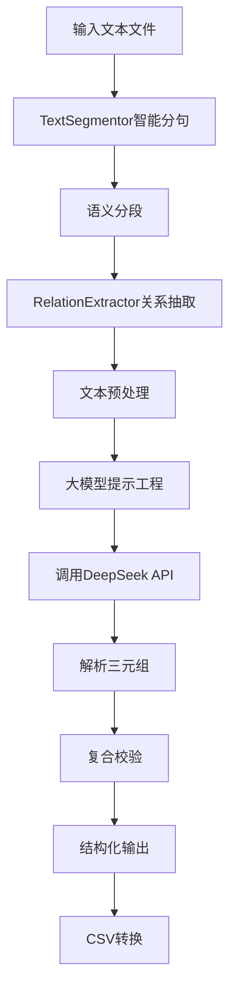

1. **总体设计思路**：

  整个脚本的三元组提取环节有TextSegmentor和RelationExtractor两个智能体串行组成的工作流,整体的流程是在第一个智能体根据输入完成分段后将结果传入    下一个负责提取三元组的智能体，该智能体的职责是学习我们给出的在地质领域的实体类别规则文件，识别文本中地质领域的实体并且根据上下文总结关系，最后    按照规定的格式生成三元组写入文件。设计这样的结构目的是解决模型生成内容的黑箱过程可能产生的错误，在第一个智能体分段的基础上，第二个智能体可以对    分好的段落并行处理提高效率，并且我们让提取的三元组与原文对应的方式写入JSON文件方便后续人工检查智能体的提取效果。

2. **提示词工程(prompt engineering)**

本应用对大模型的调整基本上是基于一种系统化提示词的框架(CRISPE)完成，该提示词框架可以使大模型更加精确的理解即将扮演的角色、处理的工作与用户的要求

代码中分别在两个智能体中嵌入了这样的提示词框架让它们完成对应的工作，并给出正确示例使其优化输出。另外，在第二个智能体完成了三元组提取环节后，还额外加入了基于提示词的三元组校验，这一步是为了防止
   
