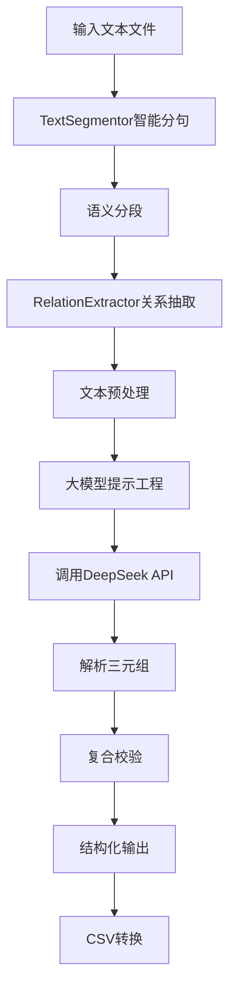

设计思路

```mermaid
flowchart TD
    A[输入文本文件] --> B[TextSegmentor智能分句]
    B --> C[语义分段]
    C --> D[RelationExtractor关系抽取]
    D --> E[文本预处理]
    E --> F[大模型提示工程]
    F --> G[调用DeepSeek API]
    G --> H[解析三元组]
    H --> I[复合校验]
    I --> J[结构化输出]
    J --> K[CSV转换]
```
